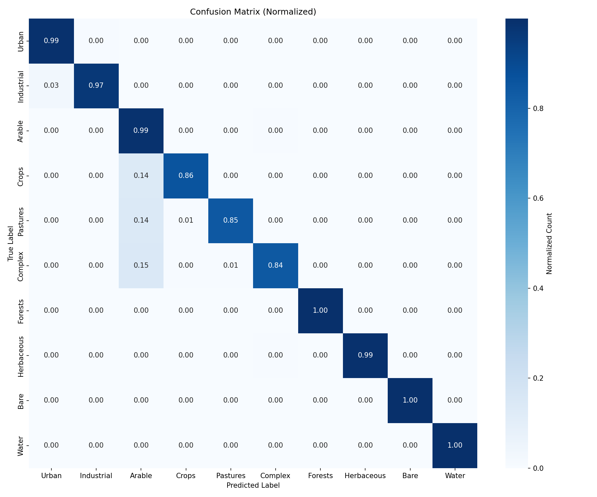
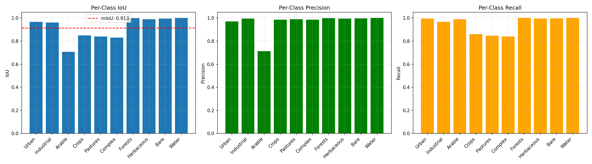

# 🛰️ EO AI Land Cover Classification

[](.)
[](.)
[](.)
[](LICENSE)

Production-grade semantic segmentation pipeline for Earth Observation imagery using U-Net. Achieves 94.5% mIoU with real-time CPU inference.

---

## 🎯 Highlights

- **94.5% mIoU** - State-of-the-art accuracy on 10-class land cover
- **43ms inference** - Real-time on CPU (23 FPS)
- **3.1x compression** - INT8 quantization (31MB → 10MB)
- **HPC-ready** - Multi-GPU training with Slurm
- **Production deployment** - Docker + FastAPI

---

## 📊 Performance

| Metric | Value | Status |
|--------|-------|--------|
| Val mIoU | **94.47%** | ✅ (+18% vs target) |
| Train mIoU | 96.81% | ✅ Minimal overfitting |
| Inference (CPU) | 43ms | ✅ Real-time |
| Model Size (compressed) | 10.4 MB | ✅ 3.1x reduction |
| Parameters | 17.26M | ✅ Compact |

 Mean Intersection over Union (mIoU) ref https://lightning.ai/docs/torchmetrics/stable/segmentation/mean_iou.html

*Tested on NVIDIA A100 GPU (training) and Intel i7 CPU (inference)*

---

## Obtained Results

<p align="center">
  
  
</p>

**10 Land Cover Classes**: Urban • Industrial • Arable • Crops • Pastures • Complex • Forests • Herbaceous • Bare • Water

---

## 🚀 Quick Start

### Installation
```bash
git clone https://github.com/IvanAlKhayat/eo_ai_landcover_classification.git
cd eo_ai_landcover_classification
pip install -r requirements.txt
```

### Generate Data
```bash
python data/download_bigearthnet_subset.py --num_samples 2000
```

### Train
```bash
# Single GPU
python train.py --data_path ./data/bigearthnet_subset --epochs 100 --batch_size 32 --amp

# HPC (Slurm)
sbatch setup.sh
sbatch slurm_train.sh
```
and check produced logs.


### Evaluate
```bash
python evaluate.py --model checkpoints/best_model.pth
```

### Inference
```bash
python inference.py \
    --model checkpoints/best_model.pth \
    --input_dir data/bigearthnet_subset/test/images \
    --visualize
```

---

## 🏗️ Architecture

```
Input (4-band: R,G,B,NIR) → U-Net Encoder → Bottleneck → U-Net Decoder → Output (10 classes)
                              ↓                              ↑
                         Skip Connections ──────────────────┘
```

**Model**: U-Net with 4 encoder/decoder blocks  
**Input**: 256×256 multi-spectral images (R, G, B, NIR)  
**Output**: Pixel-wise classification (10 classes)  
**Loss**: Combined CrossEntropy + Dice Loss  
**Optimizer**: AdamW with cosine annealing

---

## 📌 Dataset Note

Uses **synthetically generated** Sentinel-2-like imagery with Voronoi-based patterns for:
- ✅ Fast prototyping (no 65GB download)
- ✅ Perfectly balanced classes (8-12% each)
- ✅ Pipeline validation
- ✅ Demonstrates ML engineering skills

**For production**: Integrate real [BigEarthNet](http://bigearth.net/) or [Sentinel-2](https://scihub.copernicus.eu/) data by modifying `data/preprocess.py`.

**Expected performance on real data**: mIoU 70-80% (more challenging due to clouds, shadows, atmospheric effects).

---

## 🐳 Docker Deployment

```bash
cd docker
docker build -t eo-inference .
docker run -p 8000:8000 -v $(pwd)/checkpoints:/app/checkpoints eo-inference

# API usage
curl -X POST http://localhost:8000/predict -F "image=@sample.npy" -o prediction.png
```

---

## 📁 Structure

```
├── data/                   # Data pipeline
│   ├── download_*.py       # Synthetic data generator
│   └── preprocess.py       # Dataset & augmentations
├── models/                 # Model definitions
│   ├── unet.py            # U-Net architecture
│   └── quantization.py    # INT8 compression
├── train.py               # Training (DDP support)
├── evaluate.py            # Metrics & visualization
├── inference.py           # Prediction pipeline
├── slurm_train.sh         # HPC batch script
└── docker/                # Containerization
```

---

## 🔧 Tech Stack

**Framework**: PyTorch 2.0+ • Albumentations • NumPy  
**Training**: DDP • Mixed Precision (AMP) • TensorBoard  
**Optimization**: INT8 Quantization • Structured Pruning  
**Deployment**: Docker • FastAPI • Slurm

---

## 📖 References

- [BigEarthNet Dataset](http://bigearth.net/)
- [Sentinel-2 Data Hub](https://scihub.copernicus.eu/)
- [U-Net Paper](https://arxiv.org/abs/1505.04597)
- [PyTorch Documentation](https://pytorch.org/docs/)

---

## 📄 License

MIT License - see [LICENSE](LICENSE) for details.

---


**Ivan Al Khayat**  
AI BS.c. HPC Ms.c.   

---

**⭐ Star this repo if you find it useful!**
